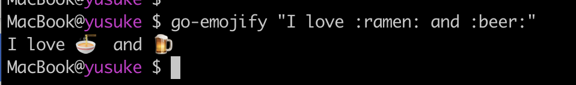

# go-emojify

Yet another _emojify_ command written in Go :ramen:

## Installation

```
$ go get github.com/yusukebe/go-emojify/cmd/go-emojify
```

## Usage

```
$ go-emojify "I love :ramen: and :beer:"
```

Output:

> I love :ramen: and :beer:



## See Also

- <https://github.com/kyokomi/emoji>
- <https://github.com/mrowa44/emojify>
- <https://github.com/lord63/pyemojify>

## License

MIT
